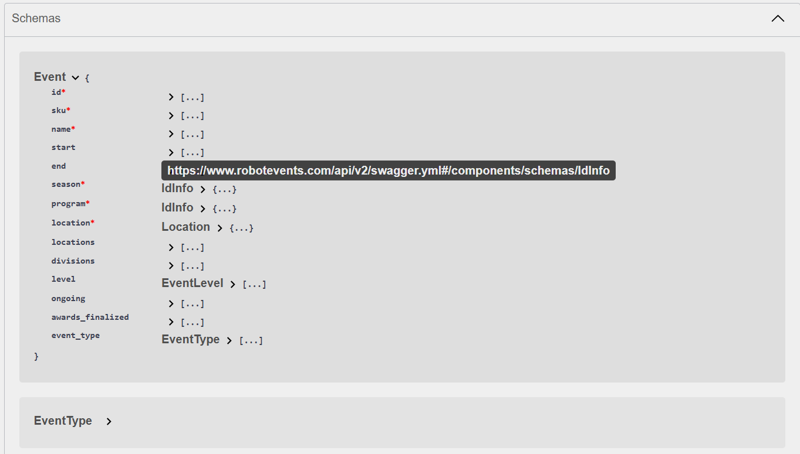

Schemas provide a formal description of the structures and data types of API requests and responses.

Descriptions and further details can be found at the bottom of the [RobotEvents API Documentation] page(https://www.robotevents.com/api/v2). See screenshot below:

Note that the parent link shown in the screenshot is used in schema-related Python scripts. 

The list of all schemas can be found in the [3-generic](./3-generic/) folder. 

### A note on `$ref`
- In expanded schemas, `$ref` has been preserved to help the reader see what other schemas are linked to the current one. 
- To disable it, for purposes like JSON validation, set `preserve_ref=False` in `*_expanded.py`.
- `$ref` is automatically preserved in `_skeleton.json` files as part of the API response. 
- If there are no linked schemas, `_skeleton.json` and `_expanded.json` will be the same.
- 